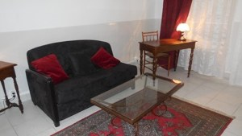
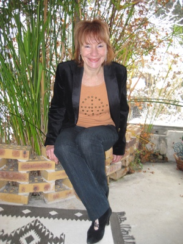

« *On finit toujours par devenir un personnage de sa propre histoire. La psychanalyse permet seulement d'accélérer ce processus* ». Jacques Lacan, *Les Ecrits*.

<h3>Consultations sur rendez-vous</h3>
<ul>
<li>Par téléphone  au 06 83 56 85 61 et au 01 34 69 47 02</li>
<li>Par mail : <a href="mailto:a.bianchini@wanadoo.fr">a.bianchini@wanadoo.fr</a></li>
</ul>

| Cabinet au :|  &nbsp; |&nbsp; |&nbsp; |&nbsp; |&nbsp; |Cabinet au :|
|--------------------------------------------------|---------|---------|---------|---------|---------|-------------------------------------------------|
|15, rue de Sévigné 				   |  &nbsp; |  &nbsp; | &nbsp; | &nbsp; | &nbsp; | 36, Avenue du Chemin Vert                       |
|75004 Paris                                       |  &nbsp; |  &nbsp; | &nbsp; | &nbsp; | &nbsp; | 95290 L'Isle-Adam                               |
|Métro Saint-Paul Le Marais|  &nbsp; | &nbsp; | &nbsp; | &nbsp; | &nbsp; |A 100 m de la clinique vétérinaire|
|               |  &nbsp; |&nbsp; |&nbsp; |&nbsp; |&nbsp; |                 |

### Consultations, entretiens, psychothérapies analytiques

### Psychanalyse individuelle

### Adultes et adolescents

<table id="photo">
  <tbody>
    <tr>
      <td>Ma pratique s’inscrit dans la continuité de la clinique psychanalytique telle qu’elle a été initialement définie par Sigmund Freud, réinterprétée par Jacques Lacan, puis développée jusqu’à aujourd’hui.</td>
      <td></td>
    </tr>
  </tbody>
</table>

 

- Membre du Cercle Freudien, membre du Salon Œdipe
- Tarifs modérés
- Consultations en français et en italien 

 

 

 

Oeuvre de Zao Wou Ki
