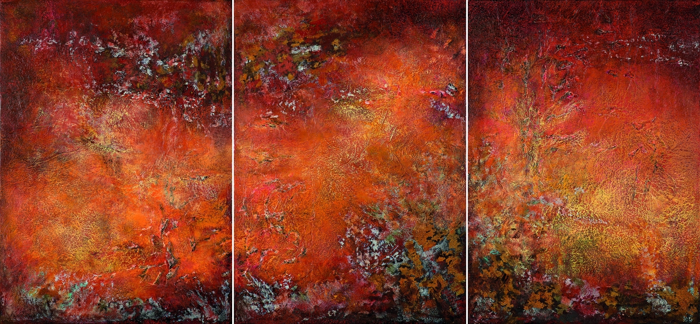
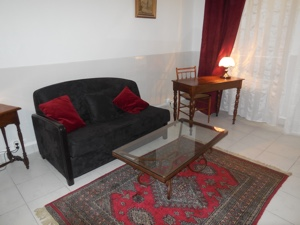

# Annik Bianchini Depeint, psychanalyste à Paris et à l'Isle-Adam, Thérapies analytiques

Tableau de peinture : 
œuvre de Zao Wou Ki

<!-- « L'analyse a pour but l'avènement d'une parole vraie » >  Jacques Lacan, Les Ecrits

<h3>Consultations sur rendez-vous</h3>
<ul>
<li>Par téléphone  06 83 56 85 61 ou 01 34 69 47 02</li>
<li>Par mail <a href="mailto:a.bianchini@wanadoo.fr">a.bianchini@wanadoo.fr</a></li>
</ul>

| Sur Paris                                          |  Sur l'Isle-Adam  |
|----------------------------------------------------|-------------------|
|15, rue de Sévigné 75004 Paris				             | 36, Avenue du Chemin Vert 95290 L'Isle-Adam|
| Métro Saint-Paul Le Marais                       | A 100 m de la clinique vétérinaire  |
|                  |   |

# Consultations, entretiens, soutien psychologique, psychothérapies analytiques, psychanalyse individuelle

# Adultes et adolescents

| Ma pratique s'inscrit dans la continuité de la clinique psychanalytique telle qu'elle a été initialement définie par Sigmund Freud, réinterprétée par Jacques Lacan, puis développée jusqu'à aujourd'hui.|  |

	
- Membre du Cercle Freudien, membre du Salon Œdipe
- Tarifs modérés
- Consultations en français et en italien 
