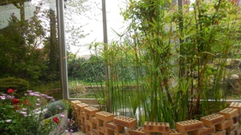

« *On finit toujours par devenir un personnage de sa propre histoire. La psychanalyse permet seulement d'accélérer ce processus* ». Jacques Lacan, *Les Ecrits*.

<h3>Consultations sur rendez-vous</h3>
<ul>
<li>Par téléphone  au 06 83 56 85 61 et au 01 34 69 47 02</li>
<li>Par mail : <a href="mailto:a.bianchini@wanadoo.fr">a.bianchini@wanadoo.fr</a></li>
</ul>

|  Cabinet au :              |  &nbsp; &nbsp; |  Cabinet au :     |
|----------------------------------------------------|--|-----------------|
|15, rue de Sévigné 				     |  | 36, Avenue du Chemin Vert |
|75004 Paris                                         |  | 95290 L'Isle-Adam|
|  Métro Saint-Paul Le Marais    |  |    A 100 m de la clinique vétérinaire     |
||  | |

### Consultations, entretiens, psychothérapies analytiques

### Psychanalyse individuelle

### Adultes et adolescents

|---------------------------------------------------------------------|---------------------------------------------------|
| Ma pratique s'inscrit dans la continuité de la clinique psychanalytique telle qu'elle a été initialement définie par Sigmund Freud, réinterprétée par Jacques Lacan, puis développée jusqu'à aujourd'hui.|  |

	
- Membre du Cercle Freudien, membre du Salon Œdipe
- Tarifs modérés
- Consultations en français et en italien 

Oeuvres de Zao Wou Ki
